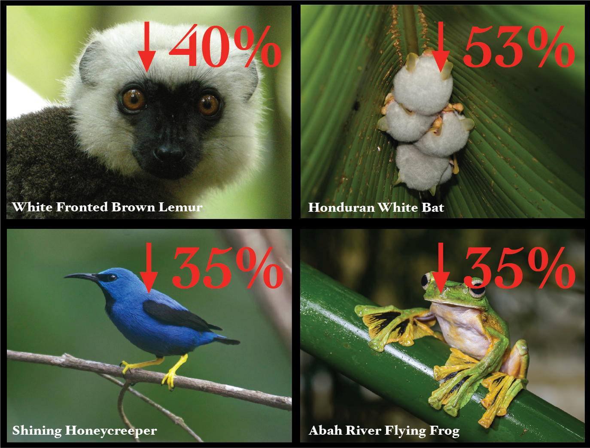
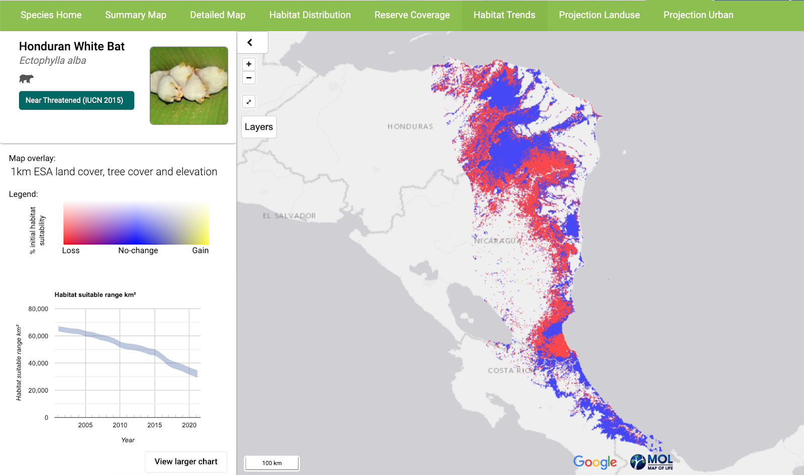

title: "Animals Are Running Out of Places to Live"
date: 2022-12-09
permalink: /press/2022/12/animals-are-running-Out-of-places-to-live
byline: Catrin Einhorn and Lauren Leatherby / New York Times

33%, 45%, even upwards of 60% – these are the staggering amounts of suitable habitat some species have lost in the past two decades alone, leaving them struggling to cling on in a dramatically changing world.

This habitat change data, calculated by the Map of Life as part of our Species Habitat Index, was featured prominently in a recent New York Times article “[Animals Are Running Out of Places to Live](https://www.nytimes.com/interactive/2022/12/09/climate/biodiversity-habitat-loss-climate.html?unlocked_article_code=I4ZyYn11IX0coKgKexXjpwboRT90tl2ggqHznTaicdjhGppWbRmV1YSsSRqm-mH8fHzyI2LvqQe9eCpqtB9lHEE4vuDVroQqQEIuET3BjDpiwHsyZ1ftObGDS0t1DnQzbaQrV9tI8_YP-izDJcX4PMv4RJXYYr-NMWEliqw1lr5QHv2OCbWc1RPBmdPd2ouourKe0L8zy7ZapArPFXQ9F4POvnlrn4ZnjGQYb4puBj3kU3w81Cdq82FFWV1cCFbxtKNKSokmFN_JBu6rzhzyX2OBOL0KwPb5QrLvlEVEtLvfZsaZ6lPT4HrmDEU2D4Qfb7SdDFgc12x-sDGbuFchYNPMwdL2kSNJBibmQ_ckYcsOfUzSHNu0iJd91A&smid=share-url)."

    

        

        
        

    

    

    

    Some of the species featured in the NYT article.
    Photo Credits: White-Fronted Brown Lemur – Frank Vassen via <a href="https://www.flickr.com/photos/42244964@N03/4023109222">Flickr</a>, <a href="https://creativecommons.org/licenses/by/2.0/">CC BY 2.0</a>; Honduran White Bat – Leyo via <a href="https://commons.wikimedia.org/wiki/File:Ectophylla_alba_Costa_Rica.jpg"> Wikimedia</a>, <a href="https://creativecommons.org/licenses/by-sa/2.5/ch/deed.en">CC BY-SA 2.5 CH</a>; Shining Honeycreeper – <a href="https://ast.wikipedia.org/wiki/Cyanerpes_lucidus#/media/">Jan Axel</a> via Wikipedia, <a href="https://creativecommons.org/licenses/by/3.0/">CC BY 3.0</a>; Abah River Flying Frog – <a href="http://www.thainationalparks.com/khao-sok-national-park">Thai National Parks</a>, <a href="https://creativecommons.org/licenses/by-sa/2.0/">CC BY-SA 2.0</a>  
    

    

“Can we find a way to share the planet with the rest of its inhabitants?” rings the plea from the article, which shares the faces of those species facing the most severe habitat loss – species like the miniscule Honduran White Bat, which has suffered a 53% loss of suitable habitat area and a 46% decrease in habitat connectivity since 2001, and the Madagascar-endemic White-Fronted Brown Lemur, which has lost 40% and 36% of its habitat area and connectivity, respectively.

    

        

        
        

    

    

        Screenshot from <a href="https://mol.org/species/habitat-trend/Ectophylla_alba" target="_blank">Map of Life</a>. 
    

The Species Habitat Index is one among our suite of biodiversity indicators that measures annual, species-level change in habitat as well as nationally-aggregated indices. Fusing remotely sensed environmental layers with species occurrence, distribution, and trait data, we calculate the change in suitable habitat area and connectivity for tens of thousands of terrestrial vertebrate species over two decades to track how ecosystem integrity and species populations change over time. The Species Habitat Index addresses Goal A of the Convention on Biological Diversity’s Post-2020 Global Biodiversity Framework:

Goal A: The integrity of all ecosystems is enhanced, with an increase of at least 15 per cent in the area, connectivity and integrity of natural ecosystems, supporting healthy and resilient populations of all species, the rate of extinctions has been reduced at least tenfold, and the risk of species extinctions across all taxonomic and functional groups, is halved, and genetic diversity of wild and domesticated species is safeguarded, with at least 90 per cent of genetic diversity within all species maintained.

The NYT article highlights the crucial decisions currently underway at the COP15 in Montreal, where BGC Center members are leading conversations about the implementation of the biodiversity indicators for national monitoring and conservation decision making.

Read the full article on [the New York Times](https://www.nytimes.com/interactive/2022/12/09/climate/biodiversity-habitat-loss-climate.html?unlocked_article_code=I4ZyYn11IX0coKgKexXjpwboRT90tl2ggqHznTaicdjhGppWbRmV1YSsSRqm-mH8fHzyI2LvqQe9eCpqtB9lHEE4vuDVroQqQEIuET3BjDpiwHsyZ1ftObGDS0t1DnQzbaQrV9tI8_YP-izDJcX4PMv4RJXYYr-NMWEliqw1lr5QHv2OCbWc1RPBmdPd2ouourKe0L8zy7ZapArPFXQ9F4POvnlrn4ZnjGQYb4puBj3kU3w81Cdq82FFWV1cCFbxtKNKSokmFN_JBu6rzhzyX2OBOL0KwPb5QrLvlEVEtLvfZsaZ6lPT4HrmDEU2D4Qfb7SdDFgc12x-sDGbuFchYNPMwdL2kSNJBibmQ_ckYcsOfUzSHNu0iJd91A&smid=share-url) and learn more about the Species Habitat Index at [here](mol.org/indicators/habitat/background).
